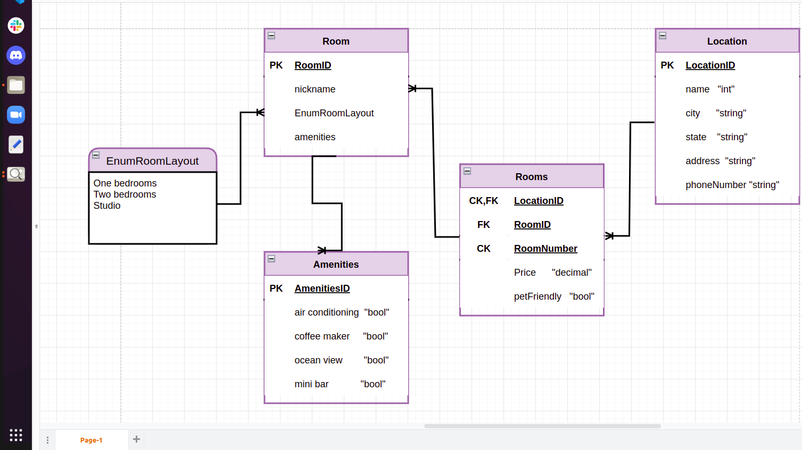

# Async-Inn

## Ola M AL-Shlool / 13-4-2022 / 18-4-2022 / 20-4-2022 / 22-4-2022 / 27-4-2022 / 8-5-2022

This project uses ASP.Net Core framework to implement a simple web app following the MVC pattern.

## Identity
- ASP.NET Core Identity is an API that supports user interface login functionality. It manages users, passwords, profile data, roles, claims, tokens, email confirmation, and more.

- Users can create an account with the login information stored in Identity or they can use an external login provider. Supported external login providers include Facebook, Google, Microsoft Account, and Twitter.

- Identity is typically configured using a SQL Server database to store user names, passwords, and profile data. Alternatively, another persistent store can be used, for example, Azure Table Storage.

## Data Transfer Objects (DTOs)

DTOs were implemented in this application in order to better control the data that was exposed to the client through the API.

Specifically, DTOs were used to:

- Flatten object graphs that containe nested objects for client convenience and readability.
- Hide any properties that should not be public, and avoid "over-posting".

## API Routes
- #### Hotel Routes: 
  - GET: api/Hotels - Get a list of all hotels
  - GET: api/Hotels/{hotelId} - Get a hotel by ID
  - PUT: api/Hotels/{hotelId} - Update a hotel by ID
  - POST: api/Hotels - Create a new hotel
  - DELETE: api/Hotels/{hotelId} - Delete a hotel

- #### Rooms Routes
  - GET: api/Rooms - Get a list of all rooms
  - GET: api/Rooms/{id} - Get a room by ID
  - PUT: api/Rooms/{id} - Update a room by ID
  - POST: api/Rooms - Create a new room
  - POST: {roomId}/Amenity/{amenityId} - Add an amenity to a room
  - DELETE: {roomId}/{amenityId} - Delete an amenity from a room
  - DELETE: {roomId} - Delete a room

- #### HotelRoom Routes: 
  - GET: /api/Hotels/{hotelId}/Rooms - Get a list of all hotelRooms
  - GET: /api/Hotels/{hotelId}/Rooms/{roomNumber} - Get a hotelRooms by ID
  - PUT: /api/Hotels/{hotelId}/Rooms/{roomNumber} - Update a hotelRooms by ID
  - POST: /api/Hotels/{hotelId}/Rooms - Create a new hotelRooms
  - DELETE: /api/Hotels/{hotelId}/Rooms/{roomNumber} - Delete a hotelRooms

- ### Amenities Routes
  - GET: api/Amenities - Get a list of all amenities
  - GET: api/Amenities/{id} - Get an amenity by ID
  - PUT: api/Amenities/{id} - Update an amenity by ID
  - POST: api/Amenities - Create a new amenity
  - DELETE: api/Amenities/{id} - Delete an amenity by ID

- ### Identity Routes:
  - /Register - Let's you add new user objects to the database
  - /Login - Retrieves a user inputed object
  
## ERD Diagram

## Explanation of ERD Diagram
- ### Hotel
    Locations is a class which holds the properties Name, City, State, Address, and PhoneNumber. All of these are VarChar except ID, which is an int.

Connected to HotelRoom.

- ### HotelRoom
    Has composite Foreign Key or HotelID and RoomID, and create a composite key called RoomNumber. It has the properties of Rate(decimal) and PetFriendly(bit).

    Connected to Hotel/Room.

- ### Room
    Has an ID, Name(string) and Layout(int). Layout receives data from a connected enum list.

    Is connected to Layout/RoomAmenities.

- ### Layout
    List of three room type: Studio, OneBedroom, and TwoBedroom. Connects to Room and nothing else.

- ### RoomAmenities
    Feeds into Room. and receives its ID. Also receives Amenities ID.

- ### Amenity
    Simple class with just an ID and a Name property.

## Explanation of ERD Diagram

- ### Location Table

  Consists of one primary key, and it has the properties of name, city, state, address, and phone number. Relationship (one-to-many) to the join table Rooms, through its primary key.

- ### Rooms

  Join table linking the Location (one-to-many) and Room (many-to-one) tables through their primary keys. Rooms have a composite key consisting of LocationID and RoomNumber.

- ### Room

  Consists of a primary key, and the basic attributes of a room. Relation to the Amenities table (one-to-many) and the EnumRoomLayout enum (many-to-one).

- ### EnumRoomLayout (Enum)

  The enum Layout contains the properties of studio, one bedroom, and two bedrooms

- ### Amenities

  Possible amenities for a given room. Has a primary key.
